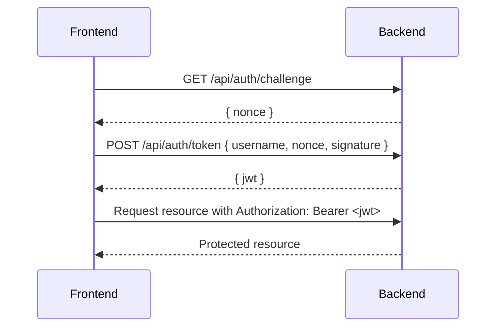

# Security Overview

This frontend authenticates with the backend through a short‑lived token that only the deployed site can obtain.

## Challenge–response handshake

1. The frontend reads fixed credentials from `.env` (`VITE_API_USERNAME` and `VITE_API_PASSWORD`).
2. It requests `/api/auth/challenge` which returns a timestamp nonce.
3. Using HMAC‑SHA256, it signs the string `<username>:<nonce>` with the password and sends `{ username, nonce, signature }` to `/api/auth/token`.
4. The backend validates the signature, ensures the nonce is fresh, checks that the request origin matches `https://mathislambert.fr`, and then issues a JWT.

## JWT properties

- Tokens expire after 60 seconds.
- The JWT includes an `aud` claim of `https://mathislambert.fr`; the backend rejects tokens with a different audience.
- Tokens are stored only in memory via a React `AuthProvider` and attached to subsequent API calls in the `Authorization` header.

This mechanism prevents other clients from obtaining tokens because they lack the shared secret embedded at build time. Tokens are never written to disk and are scoped exclusively to the `mathislambert.fr` origin.
